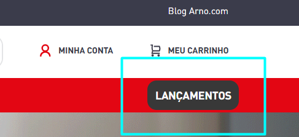

# Black Bar

Esse componente é usado para adicionar um CTA ao header, que redireciona o usuário à campanhas ativas no site. Normalmente ele leva a páginas de coleção ou landing pages. O texto e url são editáveis através do [Site Editor](https://help.vtex.com/pt/docs/tutorials/site-editor-visao-geral) da VTEX.



## Usage

react/BlackButton.js

```jsx
import BlackButton from './components/MenuMultiBranding/BlackButton';

export default BlackButton;
```

store/interfaces.json

```json
  "arno-black-button": {
    "component": "BlackButton"
  },
```

## Examples

```jsx
  "flex-layout.row#black-btn-container": {
    "props": {
      "blockClass": "black-btn-container"
    },
    "children": ["arno-black-button"]
  }
```

## Props do Componente BlackButton

| Prop            | Tipo      | Obrigatório? | Descrição                      | Valor Padrão        |
| --------------- | --------- | ------------ | ------------------------------ | ------------------- |
| **active**      | `boolean` | Não          | Ativa/desativa o Black Button  | `true`              |
| **activeCroct** | `boolean` | Não          | Ativa a integração com a Croct | `false`             |
| **icon**        | `string`  | Não          | Ícone do Black Button          | `''` (string vazia) |
| **link**        | `string`  | Não          | Link do Black Button           | `''` (string vazia) |
| **text**        | `string`  | Não          | Texto do Black Button          | `''` (string vazia) |

## Observações

1. Todos os props são **opcionais** e possuem valores padrão definidos na desestruturação
2. Quando `activeCroct` é `true`, o componente busca os dados (ícone, link, texto) da API da Croct
3. Se houver erro na integração com a Croct, o componente usa os valores passados via props
4. O componente rastreia cliques via Croct quando `activeCroct` está ativado

## Funcionamento do Componente

O componente `BlackButton` possui duas fontes de dados:

### 1. Modo VTEX (padrão)

- Usa os valores passados diretamente via props (`icon`, `link`, `text`)
- Ativado quando `activeCroct = false`

### 2. Modo Croct

- Ativado quando `activeCroct = true`
- Busca dados da API da Croct usando `croct.fetch('black-button')`
- Sobrescreve os valores das props com os dados da Croct
- Rastreia cliques com `croct.track('goalCompleted')`

### Comportamento

- Se `active = false`, o botão não é renderizado
- O clique é rastreado apenas no modo Croct
- Em caso de erro na API Croct, retorna ao modo VTEX automaticamente
