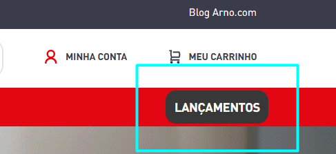

# Black Button

Componente para exibir um botão preto configurável para personalização dinâmica.



## Uso

react/BlackButton.tsx

```jsx
import BlackButton from './components/MenuMultiBranding/BlackButton';

export default BlackButton;
```

store/interfaces.json

```json
"arno-black-button": {
  "component": "BlackButton"
},
```

## Exemplos

```jsx
"flex-layout.row#black-btn-container": {
  "props": {
    "blockClass": "black-btn-container"
  },
  "children": ["arno-black-button"]
}
```

## Funcionalidades

### Botão Preto Configurável

O componente exibe um botão preto com:

- **Ícone Dinâmico**: Imagem configurável ou vazia
- **Texto Personalizável**: Texto do botão via props
- **Link Configurável**: URL do botão
- **Rastreamento**: Registra cliques de usuários

## Estrutura de Dados

### Propriedades do Componente

```typescript
{
  active: boolean,           // Ativa/desativa o botão
  icon: string,              // URL da imagem do ícone
  link: string,              // URL do botão
  text: string               // Texto do botão
}
```

## Configuração via Schema

```typescript
{
  active: {
    type: 'boolean',
    title: 'Ativar Black Button',
    default: true
  },
  icon: {
    title: 'Ícone do Black Button',
    type: 'string'
  },
  link: {
    title: 'Link do Black Button',
    type: 'string'
  },
  text: {
    title: 'Texto do Black Button',
    type: 'string'
  }
}
```