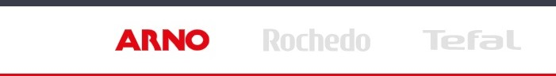

# Menu MultiBranding

Componente para exibir uma barra de menu superior com suporte multi-brand (Arno, Rochedo, Tefal, Krups) com detecção automática de URL.



## Uso

react/MenuMultiBranding.tsx

```jsx
import MenuMultiBranding from './components/MenuMultiBranding/MenuMultiBranding';

export default MenuMultiBranding;
```

store/interfaces.json

```json
"multibranding-menu": {
  "component": "MenuMultiBranding",
  "render": "lazy"
},
```

## Exemplos

```jsx
"flex-layout.row#logo-searchbar": {
  "children": [
    "multibranding-menu",
    "search-bar"
  ],
  "props": {
    "blockClass": "logo-searchbar",
    "verticalAlign": "center",
    "horizontalAlign": "left",
    "preventHorizontalStretch": true,
    "width": "grow"
  }
},
```

## Funcionalidades

### Menu Multi-Brand

O componente exibe diferentes menus baseado na URL com detecção automática:

- **Arno**: Menu padrão para URLs contendo "arno", homepage, "/blog" ou URLs não reconhecidas
- **Rochedo/Clock**: Menu específico para URLs contendo "rochedo" ou "clock"
- **Tefal**: Menu específico para URLs contendo "tefal"
- **Krups**: Menu específico para URLs contendo "krups"
- **Blog Detection**: Oculta automaticamente a barra de menu em URLs contendo "/blog"
- **Detecção Automática**: Identifica a marca pela URL atual no mount do componente

## Estrutura do Componente

```typescript
MenuLogo {
  url: string,           // URL para navegação
  imageName: string,     // Nome da imagem (arno, rochedo, tefal, krups)
  active: boolean,       // Estado ativo/inativo
  onClick: (url) => void // Handler de clique
}

MenuMultiBranding {
  currentUrl: string,    // URL atual do navegador
  navigate: function     // Runtime navigation
}
```

## Dependências

- `react`: Hooks (useState, useEffect)
- `vtex.render-runtime`: Hook useRuntime para navegação
- `./style.css`: Estilos do componente

## Observações

1. Detecção de URL ocorre no mount do componente via `window.location.pathname`
2. A barra de menu é ocultada automaticamente em URLs contendo "/blog"
3. Imagens SVG são carregadas do CDN VTEX Assets (ativas em cores, inativas em cinza)
4. Suporta regex para identificação de padrões de URL
5. Menu Arno é exibido como padrão para URLs não reconhecidas
6. Efeito hover altera a opacidade de logos inativos
