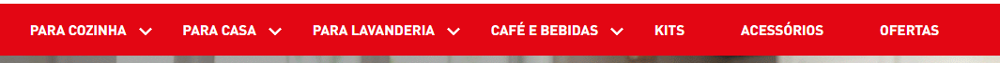

# Menu SEB Multi-Brand

Componente para exibir uma barra de menu superior com suporte multi-brand (Arno, Rochedo, Tefal, Krups) com detecção automática de URL e classe DOM.



## Uso

react/NewMenuSeb.tsx

```jsx
import NewMenuSeb from './components/NewMenuSeb/index'

export default NewMenuSeb
```

store/interfaces.json

```json
"custom-new-menu-seb": {
  "composition": "children",
  "component": "NewMenuSeb",
  "render": "lazy"
},
```

## Exemplos

```jsx
"flex-layout.row#new-menu-seb": {
  "title": "Menu Desktop SEB",
  "children": ["custom-new-menu-seb"],
  "props": {
    "blockClass": "new-menu-seb"
  }
},
"custom-new-menu-seb": {
  "children": [
    "flex-layout.row#new-menu-seb-arno",
    "flex-layout.row#new-menu-seb-rochedo",
    "flex-layout.row#new-menu-seb-tefal",
    "flex-layout.row#new-menu-seb-krups"
  ],
  "props": {
    "blockClass": "new-menu-seb"
  }
},
```

## Funcionalidades

### Detecção de Rota Multi-Brand

O componente detecta a marca pela URL ou classe DOM e renderiza o menu correspondente:

- **Arno**: Menu padrão para URLs contendo "arno", "home" ou não reconhecidas
- **Rochedo**: Menu específico para URLs contendo "rochedo" ou "clock"
- **Tefal**: Menu específico para URLs contendo "tefal"
- **Krups**: Menu específico para URLs contendo "krups"
- **Black Friday**: Menu com background específico para URLs contendo "black-friday"

### Aplicação de Background Dinâmico

Cada marca possui um background CSS específico aplicado automaticamente ao elemento do menu.

## Estrutura do Componente

```typescript
RouteConfig {
  paths: string[],           // Padrões de URL para detectar
  domClass?: string,         // Classe DOM opcional para matching
  childIndex: number,        // Índice do children a renderizar
  background: string         // Classe CSS de background
}

NewMenuSeb {
  children: ReactNode[]      // Array de componentes de menu
}
```

## Dependências

- `react`: Hooks (useState, useEffect)

## Observações

1. Detecção ocorre via `window.location.pathname` e classes DOM
2. Matching é case-insensitive
3. Fallback para menu Arno se nenhuma rota for reconhecida
4. Background CSS é aplicado ao elemento `.vtex-flex-layout-0-x-flexRow--new-menu-seb`
5. Valida índice do child antes de renderizar
