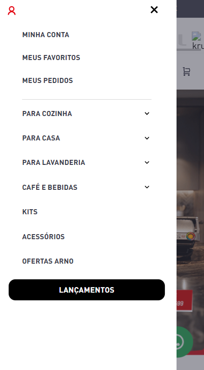

# Menu SEB Multi-Brand Mobile

Componente para exibir a lista de itens dentro do menu hambúrguer com suporte multi-brand (Arno, Rochedo, Tefal, Krups) com detecção automática de rota e classe DOM.



## Uso

react/BrandMenuMobile.tsx

```jsx
import BrandMenuMobile from "./components/MenuMultiBranding/MenuMobile/BrandMenuMobile";

export default BrandMenuMobile;
```

store/interfaces.json

```json
"brand-menu-mobile": {
  "composition": "children",
  "allowed": "*",
  "component": "BrandMenuMobile"
}
```

## Exemplos

```jsx
"flex-layout.col#drawer-1": {
  "children": [
    "menu-item#menu-minha-conta",
    "menu-item#menu-meus-favoritos",
    "menu-item#menu-atendimento",
    "brand-menu-mobile"
  ],
  "props": {
    "preventVerticalStretch": true,
    "blockClass": "drawer-1"
  }
},
"brand-menu-mobile": {
  "children": [
    "vtex.menu@2.x:menu#menu-drawer-menu-mobile-brand-arno",
    "vtex.menu@2.x:menu#menu-drawer-menu-mobile-brand-rochedo",
    "vtex.menu@2.x:menu#menu-drawer-menu-mobile-brand-tefal",
    "vtex.menu@2.x:menu#menu-drawer-menu-mobile-brand-krups"
  ]
}
```

## Funcionalidades

### Detecção de Rota Multi-Brand

O componente detecta a marca pela rota VTEX ou classe DOM e renderiza o menu correspondente:

- **Arno**: Menu padrão para rotas contendo "arno" ou DOM class `render-route-store-home`
- **Rochedo**: Menu específico para rotas contendo "rochedo" ou DOM class `render-route-store-custom-rochedo`
- **Tefal**: Menu específico para rotas contendo "tefal" ou DOM class `render-route-store-custom-tefal`
- **Krups**: Menu específico para rotas contendo "krups" ou DOM class `render-route-store-custom-krups`
- **Fallback**: Menu Arno se nenhuma rota for reconhecida

### Aplicação de Background Dinâmico

Cada marca possui uma classe CSS de background aplicada automaticamente ao elemento `.vtex-flex-layout-0-x-flexRow--brand-menu-mobile`.

## Estrutura do Componente

```typescript
BrandMenuMobile {
  children: ReactNode[]     // Array de 4 componentes de menu
}
```

## Dependências

- `react`: Hooks (useState, useEffect)
- `vtex.render-runtime`: Hook useRuntime para acesso à rota

## Observações

1. Detecção via `route.path` do VTEX Runtime e classes DOM
2. Matching é case-insensitive
3. Valida existência de children antes de renderizar
4. Otimizado com React.memo para evitar re-renders desnecessários
