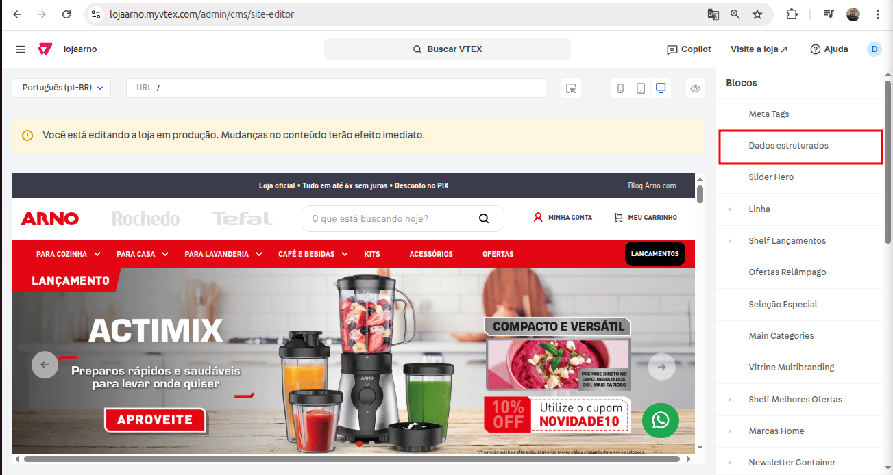

# Data Structure

Esse componente possibilita a inserção de dados estruturados através do Site Editor, para melhorias no SEO e como também a visibilidade nos mecanismos de busca de Arno, Rochedo e Tefal.



## Usage

react/DataStructure.js

```jsx
  import DataStructure from './components/DataStructure';

  export default DataStructure;
```

store/interfaces.json

```json
  "custom-arno-data-structure": {
    "component": "DataStructure"
  },
```

## Props

| Prop | Type | Required | Default | Description |
|------|------|----------|---------|-------------|
| items | array | Yes | false | Campo para inserção de dados dentro do componente |

<br>

#### Props de `items`

```json
  items: {
      type: 'array',
      items: {
        type: 'object',
        properties: {
          pathname: {
            type: 'string',
            title: 'Path Name*',
            description:
              'Caminho da URL onde os dados estruturados serão aplicados',
          },
          script: {
            title: 'Objeto JSON-LD*',
            description:
              'Insira o objeto JSON-LD que contém os dados estruturados',
            type: 'string',
            default: '{}',
          },
        },
      },
    },
```

## Examples

```jsx
  "store.home": { 
    "blocks": [
      "custom-arno-data-structure",
    ]
  }
```

## Notes

Additional information, gotchas, or important considerations when using this component.
