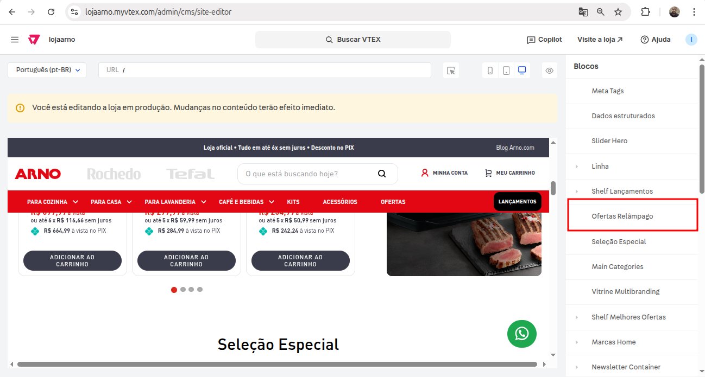

# Flash Sales Home

Esse componente é reponsável pela vitrine de ofertas relâmpago, cada produto recebe uma data e horário para iniciar e finalizar a oferta. <br>
Onde é possível configurar o componente com ID de coleção, título, descrição para a vitrine, banners, datas, dentre outras opções.



## TODO

Refatorar o código de ofertas relâmpago para não depender da vitrine de Black Friday. Criar um componente para vitrine customizada que possa ser reutilizado facilmente, e outro para ofertas relâmpago que possa ser usado em qualquer página.

## Usage

react/FlashSalesHome.js

```jsx
  import FlashSalesHome from './components/FlashSalesHome';

  export default FlashSalesHome;
```

store/interfaces.json

```json
  "custom-flash-sales-home": {
    "component": "FlashSalesHome"
  }
```

## Props

| Prop | Type | Required | Default | Description |
|------|------|----------|---------|-------------|
| activePromotions | array | Yes | false | Configuração para a página de Ofertas Relâmpago Arno, Rochedo e Tefal |

<br>

#### Props de `activePromotions`

```json
  activePromotions: {
      type: 'array',
      title: 'Vitrines de Produtos',
      items: {
        type: 'object',
        properties: {
          productClusterId: {
            title: 'ID da Coleção de Produtos',
            type: 'string',
            default: '847',
          },
          title: {
            title: 'Título da Coleção de Produtos',
            type: 'string',
            default: 'CORRA! OFERTAS RELÂMPAGO COM PREÇOS DA BLACK FRIDAY',
          },
          description: {
            title: 'Descrição da Vitrine',
            type: 'string',
            default:
              'Aproveite as ofertas relâmpago da Black Friday! Aproveite as ofertas relâmpago da Black Friday! Aproveite as ofertas relâmpago da Black Friday! Aproveite as ofertas relâmpago da Black Friday!!',
          },
          image: {
            title: 'Banner da Vitrine',
            type: 'string',
            widget: {
              'ui:widget': 'image-uploader',
            },
          },
          items: {
            type: 'array',
            title: 'Datas Inicial e Final de cada Produto',
            items: {
              type: 'object',
              title: 'Produto',
              properties: {
                id: {
                  title: 'Id do Produto',
                  type: 'string',
                  default: '1',
                },
                initialDate: {
                  title: 'Data inicial da promoção',
                  type: 'string',
                  default: '2025-10-25T00:00:00Z',
                },
                endDate: {
                  title: 'Data final da promoção',
                  type: 'string',
                  default: '2025-10-25T23:59:59Z',
                },
              },
            },
          },
        },
      },
    },
```

## Examples

```jsx
  "store.home": { 
    "blocks": [
      "custom-flash-sales-home",
    ]
  }
```

## Notes

Os produtos dentro da coleção na VTEX devem estar na ordem das datas que eles vão ser ofertados.
