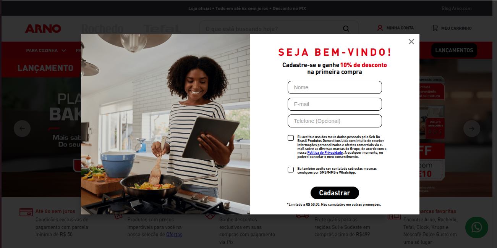

# Home Popup

Esse componente mostrar um modal pop-up na home para capturar nome, e-mail e telefone do usuário (cadastro/lead) oferecendo um cupom de desconto de boas-vindas. Dentro da página inicial de Arno, Rochedo e Tefal



## Usage

react/HomePopUp.js

```jsx
  import HomePopUp from './components/HomePopUp/HomePopUp';

  export default HomePopUp;
```

store/interfaces.json

```json
  "home-popup": {
    "component": "HomePopUp"
  },
```

## Examples

```jsx
  "store.home": { 
    "blocks": [
      "home-popup",
    ]
  }
```

## Notes

Additional information, gotchas, or important considerations when using this component.
