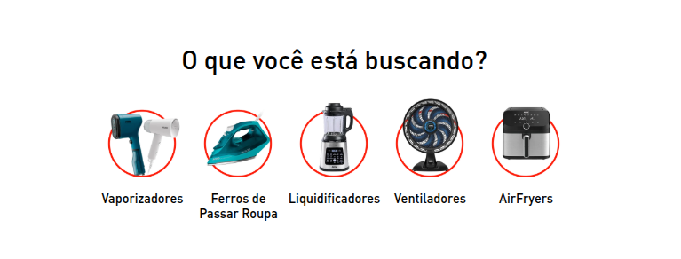

# Main Categories

Esse componente mostra as categorias da loja dentro da página inicial de Arno, Rochedo e Tefal



## Usage

react/MainCategories.js

```jsx
  import MainCategories from './components/MainCategories';

  export default MainCategories;
```

store/interfaces.json

```json
  "custom-arno-home-categories": {
    "component": "MainCategories"
  },
```

## Props

| Prop | Type | Required | Default | Description |
|------|------|----------|---------|-------------|
| categories | string | Yes | [] | Array de objetos com os dados das categorias |
| shouldRender | boolean | Yes | false | Deve renderizar o componente ou não? |

## Examples

```jsx
  "store.home": { 
    "blocks": [
      "custom-arno-home-categories",
    ]
  }
```

## Notes

Additional information, gotchas, or important considerations when using this component.
