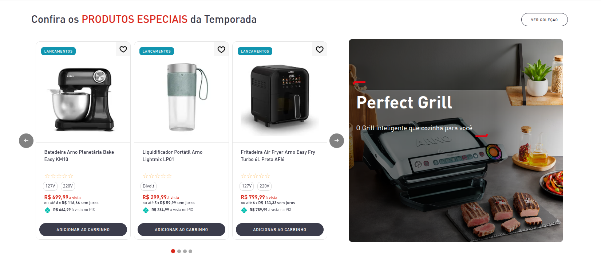

# Shelf Lancamentos

Esse componente exibe uma Shelf abaixo do Slider Hero dentro da página inicial de Arno.<br><br>
O mesmo é criado com a estrutura do VTEX IO que renderiza a listagem dos produtos a esquerda, como também um componente Custom em React onde exibe a imagem do produto a direita.



## Usage

react/ShelfBanner.js

```jsx
  import ShelfBanner from './components/ShelfBanner';

  export default ShelfBanner;
```

store/interfaces.json

```json
  "custom-arno-shelf-banner": {
    "component": "ShelfBanner"
  },
```

## Props

| Prop | Type | Required | Default | Description |
|------|------|----------|---------|-------------|
| title | string | Yes | Lançamentos | Título da imagem no banner |
| text | string | Yes | Descrição dos lançamentos | Campo para descrição do produto na imagem do banner|
| banner | string | Yes | false | Imagem a ser exibida no banner |
| imageAccentRight | string | Yes | /arquivos/arno-right-accent.png | Imagem de Acento - Direita |
| imageAccentLeft | string | Yes | /arquivos/arno-left-accent.png | Imagem de Acento - Esquerda |
| href | string | Yes | url | Link de direcionamento no banner para produto alvo |

## Examples

```jsx
  "store.home": { 
    "blocks": [
      "flex-layout.row#home-lancamentos",
    ]
  }
```

## Notes

Additional information, gotchas, or important considerations when using this component.
