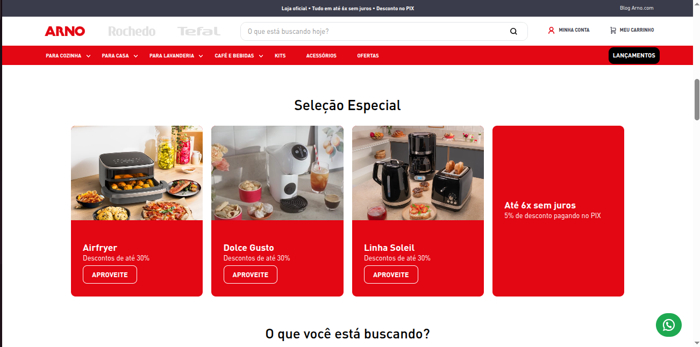

# Special Selection

Esse componente mostra uma vitrine de até 4 cards com informações promocionais da loja, com imagens e botões CTA.



## Usage

react/SpecialSelection.js

```jsx
import SpecialSelection from './components/SpecialSelection';

export default SpecialSelection;
```

store/interfaces.json

```json
  "custom-arno-special-selection": {
    "component": "SpecialSelection"
  },
```

## Props

| Prop         | Type             | Required | Default | Description                                  |
| ------------ | ---------------- | -------- | ------- | -------------------------------------------- |
| title        | string | No      |       | Título acima da vitrine |
| brandClass         | string | Yes      | arno      | Identificação de qual marca se trata (Arno, Tefal ou Rochedo) |
| cards         | Array of objects | No      | []      | Array de objetos com os dados das categorias |
| shouldRender | boolean          | No      | false   | Deve renderizar o componente ou não?         |

### Props de "cards"

Cada objeto no array de `cards` deve ter as seguintes propriedades:

| Property | Type   | Required | Description                           |
| -------- | ------ | -------- | ------------------------------------- |
| image    | string | No      | URL ou caminho da imagem do card      |
| title    | string | No       | Título do card                        |
| subTitle | string | No       | Subtítulo ou descrição do card        |
| linkUrl     | string | No      | URL de destino do botão CTA           |
| linkLabel | string | No       | Texto do botão CTA                    |

## Examples

```jsx
  "store.home": {
    "blocks": [
      "custom-arno-special-selection",
    ]
  }
```

## Notes

Additional information, gotchas, or important considerations when using this component.
