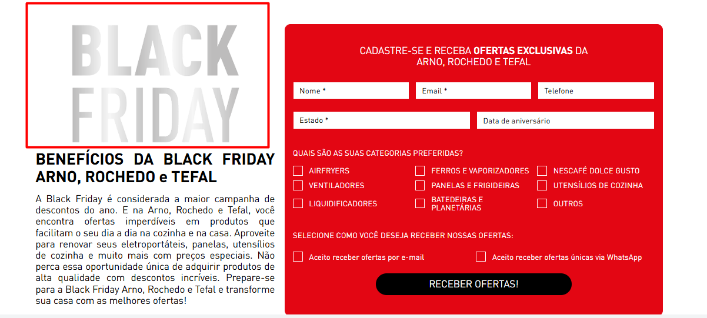
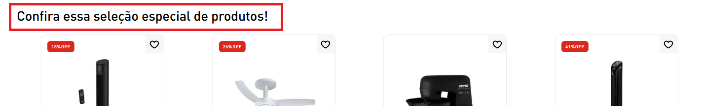
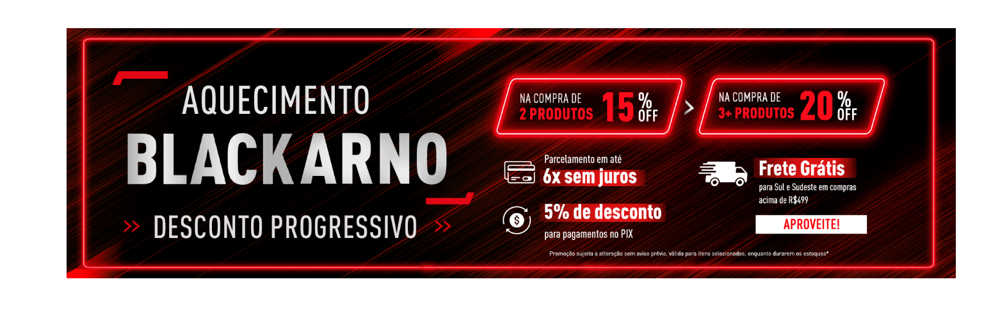
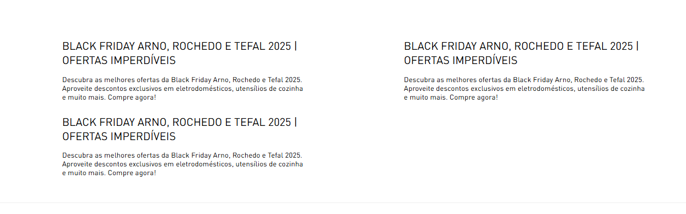

# Landing Page - Leads

O template dessa landing page foi criado para que seja possível reaproveitá-lo para diferentes cenários de captação de leads.

## Onde encontrar

Disponível no **Site Editor (VTEX)** nas páginas de landing page que usam o template `lojaarno.store@2.x:store.custom#lp-base`.

Caminho geral:

- Admin VTEX → CMS → Site Editor

## Conteúdo Primeira Dobra

```text
Conteúdo Primeira Dobra
```

O componente **Conteúdo Primeira Dobra** permite configurar o conteúdo da primeira dobra da página de landing page, incluindo título, imagem do banner e descrição.

## Campos do componente

### Título H1


Define o título principal da página.

**Tipo:** String  
**Valor padrão:** `# BENEFÍCIOS DA BLACK FRIDAY ARNO, ROCHEDO e TEFAL`

### Imagem do Banner



Upload da imagem principal do banner.

**Tipo:** Image uploader  
**Valor padrão:** `/arquivos/KV MISTO BLACK FRIDAY 2025_ARNO_TEFAL_ROCHEDO 1.png`

### Texto Alt da Imagem do Banner

Texto alternativo para acessibilidade da imagem do banner.

**Tipo:** String  
**Valor padrão:** `Arno, Rochedo e Tefal`

### Nome do Evento para o Data Layer


Identificador do evento para rastreamento analítico que será disparado ao submeter os dados dentro do formulário.

**Tipo:** String  
**Valor padrão:** `lp_leads`

### Descrição


Texto descritivo da campanha.

**Tipo:** String  
**Valor padrão:** `A Black Friday é considerada a maior campanha de descontos do ano...`

## Subtítulo acima da Barra de Benefícios


Subtítulo exibido abaixo do banner.

```text
Rich Text
```

## Barra de Benefícios


O conteúdo dessa sessão é exatamente igual ao da página da home, portanto é possível seguir o mesmo passo á passo descritos em [Barra de Benefícios](./../home/barra-de-beneficios.md)

## Título da Vitrine

Texto acima da Vitrine de Produtos



```text
Linha
└── Rich Text
```

## Vitrine de Produtos


A forma de configurar a vitrine de produtos é a mesma descrita em [Shelf Lançamentos](./../home/shelf-lancamentos.md#shelf-lancamentos-lista-de-produtos)

## Banner Secundário

Banner posicionado entre a Vitrine de Produtos e o Conteúdo SEO

```text
Linha
└── Imagem
```



## SEO

Conteúdo SEO inserido no final da página. O texto deve ser configurado em markdown. Cada tópico deve ser um novo item dentro da sessão de Conteúdo SEO


```text
Linha
└── Conteúdo SEO
```


