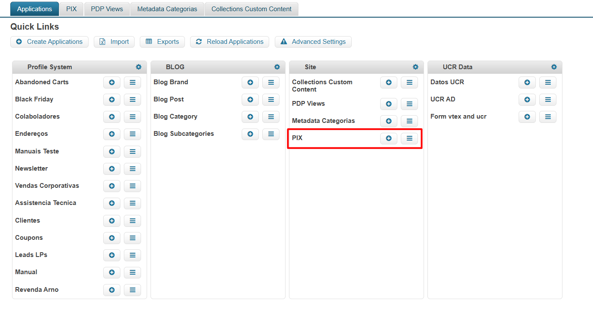
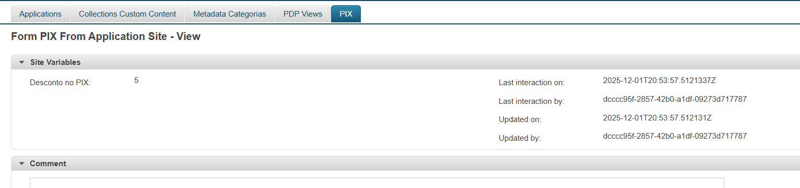
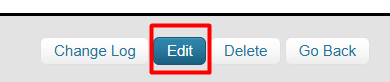
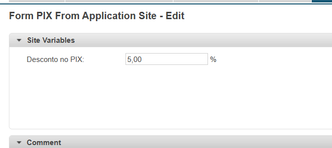

# Como alterar o valor do desconto do PIX

## Visão geral

Para gerenciar o desconto do PIX oferecido pela loja, existe uma entidade no Master Data que armazena a variável com o percentual de desconto. Esse valor é utilizado automaticamente em cálculos em diferentes páginas da plataforma.

A variável é aplicada nas seguintes seções:

- **Checkout** - Exibe o desconto na etapa final de compra
- **Minicart** - Mostra o desconto no carrinho suspenso
- **Vitrine de Produtos** - Apresenta o desconto nas listagens de produtos

## Como editar o valor do desconto

### Acessar o Master Data

1. Admin VTEX > Configurações da Loja > Storefront > Master Data > Applications
2. Navegue até a seção **Site** no Master Data
3. Localize o formulário chamado **PIX**

### Localizar o registro

O formulário contém apenas um registro com o valor atual do desconto do PIX em uso.

### Iniciar a edição

Clique na opção de edição localizada no rodapé da página, lado direito.

### Alterar o valor

Os campos serão liberados para edição. 

> **Importante**: O valor deve ser inserido como número decimal (float). Por exemplo: para 10% de desconto, insira `10.00`

Após alterar o valor, clique em **Salvar** para aplicar as mudanças em toda a loja.
